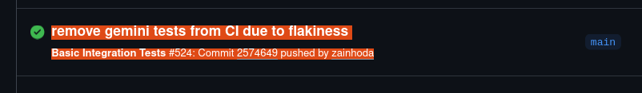
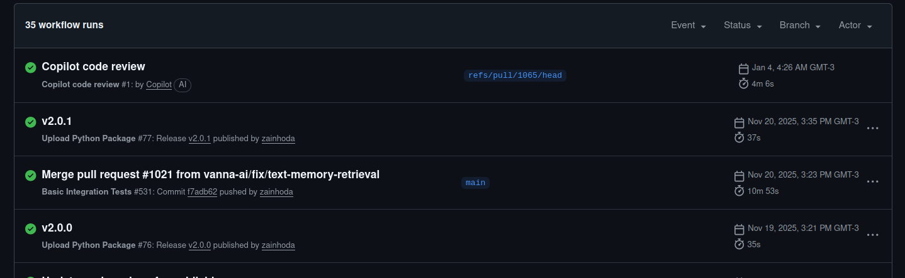

# Etapa 1 – Diagnóstico e Auditoria  


## O Cenário Atual do Ciclo de Vida do Software

**Repositório analisado:** https://github.com/vanna-ai/vanna  


## Integrantes
Josias Ribeiro de Freitas Júnior - 202200025644

Natalia Silva Santos - 202400018206

Luzia dos Santos Souza Neta - 201700017537

Anthony Amoz Santos Aragao - 202100011207


---

## Sumário Executivo

### 🎯 Status Geral do CI/CD

| Aspecto | Status | Nível |
|---------|--------|-------|
| **Integração Contínua (CI)** | ✅ Implementado | Maduro |
| **Entrega Contínua (CD)** | ⚠️ Parcial | Intermediário |
| **Automação de Testes** | ✅ Ativo | Alto |
| **Deploy Automatizado** | ⚠️ Semi-manual | Básico |

### 📊 Principais Achados

**✅ Pontos Fortes:**
- GitHub Actions configurado e funcional
- 20+ ambientes de teste via `tox`
- Pre-commit hooks para validação local
- Publicação automatizada no PyPI

**⚠️ Áreas de Atenção:**
- Testes dependem de APIs externas (instabilidade)
- Alguns testes desabilitados (gemini, ollama)
- Criação de release é manual
- Ausência de validações de segurança automatizadas

**🎯 Gatilhos Identificados:**
- **CI:** Push para `main` → Executa testes automaticamente
- **CD:** Release publicada → Build e publica no PyPI automaticamente

### 📁 Arquivos Chave Analisados

```
vanna/
├── .github/workflows/
│   ├── tests.yml              # CI - Testes de integração
│   └── python-publish.yaml    # CD - Publicação no PyPI
├── tox.ini                    # Configuração de ambientes de teste
├── .pre-commit-config.yaml    # Validações locais
└── tests/                     # Suite de testes
```

---

## 1. Objetivo da Etapa

Realizar uma investigação no repositório original com o objetivo de compreender como o ciclo de vida do software é gerenciado atualmente, com foco em práticas de **Integração Contínua (CI)** e **Entrega Contínua (CD)**, identificando automações existentes, evidências técnicas, fluxo de trabalho atual, riscos e gargalos.


## 2. Investigação de Ferramentas de CI/CD

### 2.1 Ferramentas Identificadas

O projeto utiliza GitHub Actions como ferramenta de CI/CD.

A evidência pode ser confirmada pela aba **Actions** do repositório, onde estão listados diversos workflows ativos, incluindo:

- *Basic Integration Tests*
- *Copilot code review*
- *Upload Python Package*

Esses workflows indicam a presença de automação para:
- Execução de testes de integração
- Apoio à revisão de código
- Empacotamento e publicação de pacotes Python


## 3. Evidências Técnicas

### 3.1 Arquivos de Configuração

O repositório contém a pasta:
`.github/workflows/`

Esse diretório é o padrão do GitHub Actions para armazenar arquivos de configuração no formato `.yml`, que definem:
- Gatilhos de execução (push, pull request, releases)
- Etapas de build, teste e publicação
- Dependências e ambientes de execução

#### Workflows Identificados no Repositório Clonado:

**Arquivo:** `vanna/.github/workflows/tests.yml`
- **Workflow:** Basic Integration Tests
- **Gatilho:** Push na branch `main`

**Arquivo:** `vanna/.github/workflows/python-publish.yaml`
- **Workflow:** Upload Python Package
- **Gatilho:** Publicação de release

Esses arquivos constituem a principal evidência da adoção de CI/CD no projeto.


### 3.2 Histórico de Pull Requests

O projeto apresenta:
- Grande volume de Pull Requests abertas e fechadas
- Uso recorrente de PRs como mecanismo principal de integração de código

A análise do histórico de PRs indica:
- Uso consistente de revisão de código
- Execução automática de checks de CI associados às PRs
- Integração de mudanças baseada em validações automatizadas


## 4. Mapeamento do Fluxo Atual

### 4.1 Fluxo de Desenvolvimento Identificado

**Diagrama do Fluxo Atual:**

```
┌─────────────────────────────────────────────────────────────────┐
│                    FLUXO DE DESENVOLVIMENTO                     │
└─────────────────────────────────────────────────────────────────┘

1. Desenvolvedor cria branch/fork
   │
   ├── Trabalha localmente
   │   └── Pre-commit hooks validam código
   │       ├── trailing-whitespace
   │       ├── end-of-file-fixer
   │       └── isort (organização de imports)
   │
2. Abre Pull Request
   │
   ├── [GATILHO AUTOMÁTICO]
   │
3. GitHub Actions: Workflow "Basic Integration Tests"
   │   (.github/workflows/tests.yml)
   │
   ├── Setup: Ubuntu + Python 3.11
   │
   ├── Executa: tox
   │   ├── ruff (linting)
   │   ├── mypy (type checking)
   │   ├── py311-unit (testes unitários)
   │   ├── py311-anthropic (com ANTHROPIC_API_KEY)
   │   ├── py311-openai (com OPENAI_API_KEY)
   │   ├── py311-chromadb, qdrant, faiss...
   │   └── py311-*-sanity (testes de databases)
   │
   ├── ✅ Sucesso: PR pode ser merged
   └── ❌ Falha: Corrigir e commitar novamente
   │
4. Merge para main
   │
   ├── [GATILHO AUTOMÁTICO - novo commit em main]
   │
5. GitHub Actions: "Basic Integration Tests" roda novamente
   │
6. [PROCESSO MANUAL] Mantenedor cria Release no GitHub
   │
   ├── [GATILHO AUTOMÁTICO - release published]
   │
7. GitHub Actions: Workflow "Upload Python Package"
   │   (.github/workflows/python-publish.yaml)
   │
   ├── Setup: Ubuntu + Python 3.x
   ├── Build: python -m build
   └── Publish: PyPI (com PYPI_API_TOKEN)
       │
       └── ✅ Pacote disponível em PyPI
```

**Pontos de automação:**
- ✅ Validação local (pre-commit)
- ✅ Testes em PR
- ✅ Testes em push para main
- ✅ Build e publicação após release

**Gargalos manuais:**
- ⚠️ Criação e publicação de release (etapa 6)


### 4.2 Integração Contínua (CI)

- Presente e funcional
- Automatiza testes e validações
- Reduz riscos de integração de código defeituoso

#### 4.2.1 Workflow: `Basic Integration Tests`

**Arquivo:** `vanna/.github/workflows/tests.yml`

Este workflow é executado automaticamente sempre que há alterações na main.

**Gatilho configurado:**

```yaml
on:
  push:
    branches:
      - main
```

**Ambiente de execução:**

```yaml
jobs:
  build:
    runs-on: ubuntu-latest
    steps:
    - uses: actions/checkout@v4
    - name: Set up Python 3.11
      uses: actions/setup-python@v5
      with:
        python-version: "3.11"
```

**Execução dos testes:**

```yaml
    - name: Run tests
      env:
        PROTOCOL_BUFFERS_PYTHON_IMPLEMENTATION: python
        VANNA_API_KEY: ${{ secrets.VANNA_API_KEY }}
        OPENAI_API_KEY: ${{ secrets.OPENAI_API_KEY }}
        MISTRAL_API_KEY: ${{ secrets.MISTRAL_API_KEY }}
        ANTHROPIC_API_KEY: ${{ secrets.ANTHROPIC_API_KEY }}
        GEMINI_API_KEY: ${{ secrets.GEMINI_API_KEY }}
        SNOWFLAKE_ACCOUNT: ${{ secrets.SNOWFLAKE_ACCOUNT }}
        SNOWFLAKE_USERNAME: ${{ secrets.SNOWFLAKE_USERNAME }}
        SNOWFLAKE_PASSWORD: ${{ secrets.SNOWFLAKE_PASSWORD }}
      run: tox
```

> **Análise Técnica:**
> - O workflow usa `tox` para orquestrar os testes
> - Requer múltiplas chaves de API de serviços externos (OpenAI, Mistral, Anthropic, Gemini)
> - Depende de credenciais do Snowflake
> - **Gargalo identificado:** A execução dos testes depende de serviços externos e APIs de terceiros, o que pode causar instabilidade

> Evidências Diretas:

Na lista de execução de workflows [link](https://github.com/vanna-ai/vanna/actions?utm_source=chatgpt.com)


Cada execução listada mostra:

Que o workflow Basic Integration Tests é disparado automaticamente quando um commit é feito na main. Que testes são executados (há duração do run e indicação de jobs). Esse padrão confirma que há CI ativa no repositório.

No histórico desses runs, também há referências a commits que comentam mudanças no teste devido a problemas externos:



ou seja, essa uma evidência técnica de instabilidade nos testes, e nos dá um insight sobre um gargalo: testes de integração podem falhar por dependências externas (serviços de IA ou bases de dados).


### 4.3 Entrega Contínua (CD)

**Arquivo:** `vanna/.github/workflows/python-publish.yaml`

O projeto implementa **CD parcial** através de publicação automatizada no PyPI (Python Package Index).

#### Gatilho do Deploy Automatizado:

```yaml
name: Upload Python Package

on:
  release:
    types: [published]
```

> **O que gatilha o deploy?**
> - O workflow é acionado **exclusivamente** quando uma release é publicada no GitHub
> - Não roda em push ou pull request
> - Requer ação manual de criar e publicar a release

#### Pipeline de Publicação:

**1. Preparação do ambiente:**

```yaml
jobs:
  deploy:
    runs-on: ubuntu-latest
    steps:
    - uses: actions/checkout@v3
    - name: Set up Python
      uses: actions/setup-python@v3
      with:
        python-version: '3.x'
```

**2. Build do pacote:**

```yaml
    - name: Install dependencies
      run: |
        python -m pip install --upgrade pip
        pip install build
    - name: Build package
      run: python -m build
```

**3. Publicação no PyPI:**

```yaml
    - name: Publish package
      uses: pypa/gh-action-pypi-publish@27b31702a0e7fc50959f5ad993c78deac1bdfc29
      with:
        user: __token__
        password: ${{ secrets.PYPI_API_TOKEN }}
```

#### Análise do Modelo de CD:

- ✅ **Automatizado:** Uma vez publicada a release, o pacote é construído e publicado automaticamente
- ⚠️ **Gatilho Manual:** A criação da release requer intervenção humana
- ⚠️ **CD Parcial:** Não há deploy automatizado de aplicação ou serviço em ambiente produtivo
- ✅ **Entrega de Artefato:** O pacote Python é entregue ao PyPI de forma consistente

**Evidência visual das execuções:**

> obs: v2.0.0, v2.0.1



Cada execução do workflow mostra explicitamente: `"Release vX.Y.Z published"`, confirmando o vínculo direto entre releases do GitHub e publicação no PyPI.

#### Limitações Identificadas:

1. **Ausência de Deploy Contínuo completo:** Não há evidências de deploy automatizado em ambientes de staging ou produção
2. **Dependência de processo manual:** A criação da release é o gargalo manual no fluxo
3. **Escopo limitado:** A automação se restringe à publicação do pacote, não ao deployment de serviços


## 5. Riscos e Gargalos Identificados

### 5.1 Riscos

#### 5.1.1 Riscos de CI

**Dependência de Serviços Externos:**

Conforme evidenciado no arquivo `vanna/.github/workflows/tests.yml`, o workflow de testes depende de múltiplos serviços externos:

```yaml
env:
  VANNA_API_KEY: ${{ secrets.VANNA_API_KEY }}
  OPENAI_API_KEY: ${{ secrets.OPENAI_API_KEY }}
  MISTRAL_API_KEY: ${{ secrets.MISTRAL_API_KEY }}
  ANTHROPIC_API_KEY: ${{ secrets.ANTHROPIC_API_KEY }}
  GEMINI_API_KEY: ${{ secrets.GEMINI_API_KEY }}
  SNOWFLAKE_ACCOUNT: ${{ secrets.SNOWFLAKE_ACCOUNT }}
```

**Riscos identificados:**
- Falhas nos testes por indisponibilidade de APIs externas (não relacionadas ao código)
- Custos de execução associados ao consumo de APIs pagas
- Possível vazamento de informações sensíveis se secrets não forem gerenciados adequadamente

#### 5.1.2 Riscos de CD

**Processo Manual de Release:**

O workflow de publicação em `vanna/.github/workflows/python-publish.yaml` só é acionado quando uma release é publicada:

```yaml
on:
  release:
    types: [published]
```

**Riscos identificados:**
- Dependência de intervenção humana para iniciar o processo de entrega
- Possível erro humano na criação da release (versionamento incorreto, notas de release incompletas)
- Risco de inconsistência entre ambientes caso o deploy não seja totalmente automatizado
- Ausência de validações automáticas adicionais (ex: segurança, análise de vulnerabilidades)


### 5.2 Gargalos Manuais

#### 5.2.1 Gargalos no CI

**Complexidade da Suite de Testes:**

Conforme identificado no arquivo `vanna/tox.ini`, o CI executa mais de 20 ambientes de teste diferentes:

```ini
envlist =
    ruff                          # Linting
    mypy                          # Type checking
    py311-unit                    # Testes unitários
    py311-agent-memory-sanity
    py311-anthropic              # ← Requer ANTHROPIC_API_KEY
    py311-openai                 # ← Requer OPENAI_API_KEY
    py311-chromadb
    py311-qdrant
    py311-faiss
    py311-postgres-sanity
    py311-sqlite-sanity
    py311-snowflake-sanity       # ← Requer SNOWFLAKE_*
    py311-mysql-sanity
    # ... mais 8 ambientes de database
```

**Gargalos identificados:**

1. **Tempo de execução elevado:** Executar 20+ ambientes sequencialmente pode levar muito tempo
2. **Dependência de APIs externas:** Testes como `py311-anthropic` e `py311-openai` dependem de serviços externos disponíveis
3. **Configuração de secrets:** Necessidade de manter múltiplos secrets sincronizados e válidos
4. **Manutenção complexa:** Atualizar dependências em 20+ ambientes diferentes

**Evidência do impacto:**

Alguns testes foram comentados no próprio `tox.ini`, indicando problemas:

```ini
; [testenv:py311-gemini]
; description = Test with Google Gemini
; ...
; [testenv:py311-ollama]
; description = Test with Ollama
; ...
```

Isso sugere que nem todos os testes estão ativos, possivelmente por instabilidade ou indisponibilidade.

#### 5.2.2 Gargalos no CD

Conforme o workflow `vanna/.github/workflows/python-publish.yaml`:

```yaml
on:
  release:
    types: [published]  # <- Gatilho manual
```

**Gargalos identificados:**
- Necessidade de intervenção humana para criar e publicar a release
- Maior tempo de entrega de novas versões aos usuários
- Potencial erro humano em processos repetitivos
- Ausência de automação para validação de qualidade antes da publicação


## 6. Configurações Adicionais Identificadas

### 6.1 Tox Configuration

**Arquivo:** `vanna/tox.ini`

O projeto utiliza `tox` para gerenciar ambientes de teste, conforme referenciado no workflow de CI:

```yaml
- name: Run tests
  run: tox
```

#### Ambientes de Teste Configurados:

```ini
[tox]
envlist =
    ruff
    mypy
    py311-unit
    py311-agent-memory-sanity
    py311-anthropic
    py311-openai
    py311-chromadb
    py311-qdrant
    py311-faiss
    py311-postgres-sanity
    py311-sqlite-sanity
    py311-snowflake-sanity
    py311-mysql-sanity
    py311-clickhouse-sanity
    py311-oracle-sanity
    py311-bigquery-sanity
    py311-duckdb-sanity
    py311-mssql-sanity
    py311-presto-sanity
    py311-hive-sanity
```

**Análise da configuração:**

1. **Validação de código:**
   ```ini
   [testenv:ruff]
   description = Check code formatting and linting with ruff
   commands =
       ruff format --check src/vanna/ tests/
       ruff check src/vanna/ tests/
   ```

2. **Type checking:**
   ```ini
   [testenv:mypy]
   description = Run mypy type checking with strict mode
   commands =
       mypy src/vanna/tools src/vanna/core ... --strict
   ```

3. **Testes unitários sem dependências externas:**
   ```ini
   [testenv:py311-unit]
   description = Run unit tests (no external dependencies required)
   commands =
       pytest tests/test_tool_permissions.py tests/test_llm_context_enhancer.py ...
   ```

4. **Testes de integração com APIs externas:**
   ```ini
   [testenv:py311-anthropic]
   description = Test with Anthropic
   extras = anthropic
   passenv = ANTHROPIC_API_KEY
   ```

> **Observação importante:** O arquivo `tox.ini` confirma o que foi identificado no workflow de CI - há uma clara separação entre:
> - **Testes unitários** (`py311-unit`) que não requerem dependências externas
> - **Testes de sanidade** (`py311-*-sanity`) que testam imports e configurações básicas
> - **Testes de integração** que requerem chaves de API e serviços externos

Isso explica por que o workflow de CI precisa de tantas secrets configuradas.

### 6.2 Pre-commit Hooks

**Arquivo:** `vanna/.pre-commit-config.yaml`

O repositório possui configuração de pre-commit hooks para validações locais antes do commit:

```yaml
repos:
  - repo: https://github.com/pre-commit/pre-commit-hooks
    rev: v3.2.0
    hooks:
      - id: trailing-whitespace
      - id: end-of-file-fixer
      - id: check-merge-conflict
      - id: debug-statements
      - id: mixed-line-ending

  - repo: https://github.com/pycqa/isort
    rev: 5.12.0
    hooks:
      - id: isort
        args: [ "--profile", "black", "--filter-files" ]
```

**Validações automáticas locais:**
- Remoção de espaços em branco no final das linhas
- Garantia de nova linha no final dos arquivos
- Detecção de conflitos de merge não resolvidos
- Detecção de statements de debug deixados no código
- Padronização de imports com `isort`

> **Benefício:** Estas validações acontecem **antes** do commit chegar ao GitHub, reduzindo o número de execuções de CI que falhariam por questões de formatação.

### 6.3 Estrutura de Testes

**Diretório:** `vanna/tests/`

O repositório possui uma pasta dedicada aos testes com arquivos identificados:

```
tests/
├── conftest.py                    # Configuração de fixtures pytest
├── test_agents.py                 # Testes de agentes
├── test_agent_memory_sanity.py    # Sanity tests de memória
├── test_agent_memory.py           # Testes completos de memória
├── test_azureopenai_llm.py        # Integração Azure OpenAI
├── test_database_sanity.py        # Sanity tests de databases
├── test_gemini_integration.py     # Integração Google Gemini
├── test_legacy_adapter.py         # Testes de adaptador legado
├── test_llm_context_enhancer.py   # Testes de contexto LLM
├── test_memory_tools.py           # Testes de ferramentas de memória
├── test_ollama_direct.py          # Integração Ollama
├── test_tool_permissions.py       # Testes de permissões
└── test_workflow.py               # Testes de workflow
```

Esses testes são executados pelo workflow de CI através do comando `tox`, que por sua vez utiliza `pytest` para execução.


## 7. Conclusão 

O projeto **vanna-ai/vanna** apresenta um nível maduro de **Integração Contínua**, com uso efetivo de GitHub Actions, testes automatizados e integração via Pull Requests.

### Pontos Fortes:

1. **CI bem estruturado:**
   - Gatilho automático em push para `main`
   - Ambiente de testes consistente (Python 3.11, Ubuntu)
   - Suite de testes abrangente executada via `tox`

2. **CD parcialmente implementado:**
   - Publicação automatizada no PyPI após criação de release
   - Build e deploy do pacote totalmente automatizados

### Oportunidades de Melhoria:

#### 7.3.1 Otimização do CI

**Problema identificado:** A suite de testes do `tox.ini` contém 20+ ambientes, alguns comentados (desabilitados):

```ini
; [testenv:py311-gemini]
; [testenv:py311-ollama]
```

**Recomendações:**

1. **Paralelização de testes:**
   - Configurar GitHub Actions para executar testes em paralelo usando matrix strategy:
   ```yaml
   strategy:
     matrix:
       test-env: [unit, anthropic, openai, chromadb, ...]
   ```

2. **Separação de testes por tipo:**
   - **Fast tests (< 1min):** Executar em todo push
   - **Integration tests:** Executar apenas em PRs para main
   - **Full suite:** Executar apenas antes de releases

3. **Redução de dependências externas:**
   - Implementar mocks para APIs externas nos testes de integração
   - Manter testes E2E reais apenas como opcionais/noturnos

4. **Reativar testes comentados:**
   - Investigar por que `py311-gemini` e `py311-ollama` estão desabilitados
   - Resolver problemas de instabilidade ou remover definitivamente

#### 7.3.2 Automação Completa do CD

**Problema identificado:** O gatilho de CD é manual via release publication:

```yaml
on:
  release:
    types: [published]
```

**Recomendações:**

1. **Semantic Release:**
   - Implementar versionamento automático baseado em commits (conventional commits)
   - Gerar releases automaticamente quando PR é merged para main

2. **Pipeline de CD estendido:**
   ```yaml
   # Exemplo de workflow aprimorado
   on:
     push:
       branches: [main]
   
   jobs:
     test:
       # Executar testes
     
     create-release:
       needs: test
       if: contains(github.event.head_commit.message, '[release]')
       # Criar release automaticamente
     
     publish:
       needs: create-release
       # Publicar no PyPI
   ```

3. **Ambientes de validação:**
   - Criar ambiente de staging para testes pré-produção
   - Implementar canary releases para reduzir riscos

#### 7.3.3 Segurança e Qualidade

**Lacunas identificadas:** Ausência de validações de segurança no pipeline atual.

**Recomendações:**

1. **Adicionar workflow de segurança:**
   ```yaml
   name: Security Scan
   on: [push, pull_request]
   
   jobs:
     security:
       runs-on: ubuntu-latest
       steps:
         - uses: actions/checkout@v4
         - name: Run Bandit (Python security scanner)
           run: bandit -r src/
         - name: Check dependencies for vulnerabilities
           run: pip-audit
   ```

2. **Adicionar análise de código:**
   - Integrar SonarQube ou CodeQL para análise estática
   - Configurar coverage mínimo exigido

3. **Validação de dependências:**
   - Automatizar verificação de dependências desatualizadas
   - Criar PRs automáticos para atualização de segurança

Entretanto, a **Entrega Contínua (CD)** não é claramente identificável como totalmente automatizada, representando uma oportunidade de melhoria para reduzir riscos, gargalos e aumentar a eficiência do ciclo de vida do software.

Esta análise estabelece uma base sólida para as próximas etapas de evolução e otimização do pipeline CI/CD do projeto.


---

## 8. Referências aos Arquivos do Repositório Clonado

Todos os trechos de código e configurações apresentados neste documento foram extraídos do clone local do repositório. Abaixo estão os caminhos completos para verificação:

### 8.1 Workflows do GitHub Actions

| Arquivo | Caminho no Repositório Clonado |
|---------|--------------------------------|
| Basic Integration Tests | `vanna/.github/workflows/tests.yml` |
| Upload Python Package | `vanna/.github/workflows/python-publish.yaml` |

### 8.2 Configurações de Testes e Qualidade

| Arquivo | Caminho no Repositório Clonado | Linhas Chave |
|---------|--------------------------------|--------------|
| Configuração Tox | `vanna/tox.ini` | 1-243 (completo) |
| Pre-commit Hooks | `vanna/.pre-commit-config.yaml` | 1-20 (completo) |
| Testes Unitários | `vanna/tests/test_tool_permissions.py` | - |
| Testes de Integração | `vanna/tests/test_gemini_integration.py` | - |
| Testes de Workflow | `vanna/tests/test_workflow.py` | - |

### 8.3 Comandos para Verificação Local

Para verificar as evidências apresentadas, execute os seguintes comandos na raiz do projeto:

```bash
# Ver workflow de CI
cat vanna/.github/workflows/tests.yml

# Ver workflow de CD
cat vanna/.github/workflows/python-publish.yaml

# Ver configuração de tox (ambientes de teste)
cat vanna/tox.ini

# Ver pre-commit hooks
cat vanna/.pre-commit-config.yaml

# Listar todos os testes disponíveis
ls -la vanna/tests/

# Verificar histórico de workflows no GitHub
# (requer navegador ou gh CLI)
gh workflow list --repo vanna-ai/vanna
```

### 8.4 Estrutura Completa do Repositório Clonado

```
vanna/
├── .github/
│   ├── ISSUE_TEMPLATE/
│   └── workflows/
│       ├── python-publish.yaml    # ⭐ CD - Publicação PyPI
│       └── tests.yml               # ⭐ CI - Testes integração
├── .gitattributes
├── .gitignore
├── .pre-commit-config.yaml         # ⭐ Validações locais
├── CONTRIBUTING.md
├── examples/
├── frontends/
├── img/
├── notebooks/
├── papers/
├── pyproject.toml
├── README.md
├── setup.cfg
├── src/                            # Código fonte
│   └── vanna/
├── tests/                          # ⭐ Suite de testes
│   ├── conftest.py
│   ├── test_agents.py
│   ├── test_agent_memory.py
│   ├── test_database_sanity.py
│   ├── test_gemini_integration.py
│   ├── test_workflow.py
│   └── ... (13 arquivos de teste)
└── tox.ini                         # ⭐ Configuração ambientes teste
```

**Legenda:** ⭐ = Arquivo crítico para CI/CD


